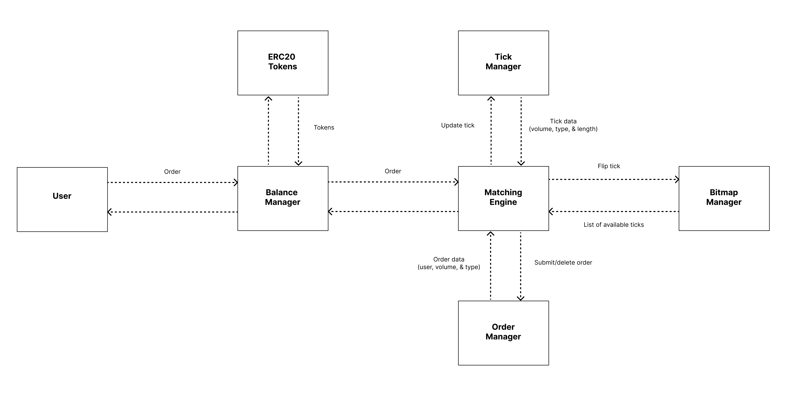
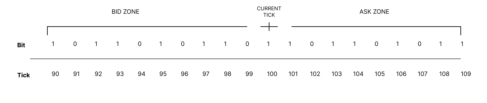

# 📝 Order Book

**High Level Architecture**

<figure><figcaption>
Orderbook architecture
</figcaption></figure>

### 1. Balance Manager 

Acts as intermediary that handles all user-facing operations and token management. It verifies user balances before processing orders, interacts with ERC20 token contracts for deposits and withdrawals, and ensures all token transfers are executed correctly. When users place orders, the Balance Manager validates them and forwards valid ones to the Matching Engine while maintaining accurate balance records.

### 2. Matching Engine 

Serves as the heart of the orderbook system. It receives validated orders from the Balance Manager and orchestrates the entire matching process. By interacting with the Tick Manager for price information, the Order Manager for order data, and the Bitmap Manager for efficient tick tracking, it determines when orders can be matched and executed. The Matching Engine makes the crucial decisions about which orders to match based on price and time priority. There is no state stored in this contract.

### 3. Bitmap Manager 

Implements an efficient data structure for tracking available price ticks in the system. Using a bitmap-based approach similar to Uniswap's implementation, it optimizes gas usage and memory efficiency when scanning for viable price levels. The Bitmap Manager provides the Matching Engine with quick access to active price levels, making the order matching process more gas-efficient.

<figure><figcaption>
Bitmap
</figcaption></figure>

### 4. Order Manager 

Maintains of all active orders in our system. It stores essential order information including the user's address, order volume, and order type. When orders are submitted or need to be deleted, the Order Manager handles these operations and ensures the orderbook's state remains consistent. It provides the Matching Engine with necessary order details for execution.

This contract implementation leverages direct slot storage access, a low-level storage pattern that significantly reduces gas costs compared to traditional storage variables. In our system, each order's data is carefully packed into storage slots using a deterministic slot calculation pattern. Each slot stores user address and the volume. While the key used for each slots are consist of its tick and order index.

<figure><figcaption>
Order storage
</figcaption></figure>

### 5. Tick Manager 

Instead of storing orders in a traditional list that requires shifting everything when orders are added or removed, it uses a clever system of tracking just the starting position and the number of orders. Think of it like a circular waiting line with 256 slots at each price - when orders are filled or cancelled, instead of moving all remaining orders forward, the system simply updates where the line begins and how many orders are in it. This approach also keeps track of the total volume at each price level. This system is its efficiency - when you need to find orders at a specific price, you just need to know where to start looking (start index) and how many orders to look at (length), making it very fast and resource-friendly to manage large numbers of orders.&#x20;

<figure><figcaption>
Tick data update
</figcaption></figure>

The diagram shows us how order matching works at a specific tick price. When an order is matched, we simply update the start\_index and length values instead of reorganizing all remaining orders. To iterate through all orders at this tick, we only need to begin from the specified start\_index and process the number of orders indicated by the length value. This mechanism ensures gas efficiency by eliminating the need to shift remaining orders after each match - we just update two values (start\_index and length) rather than performing expensive array reorganization operations.
